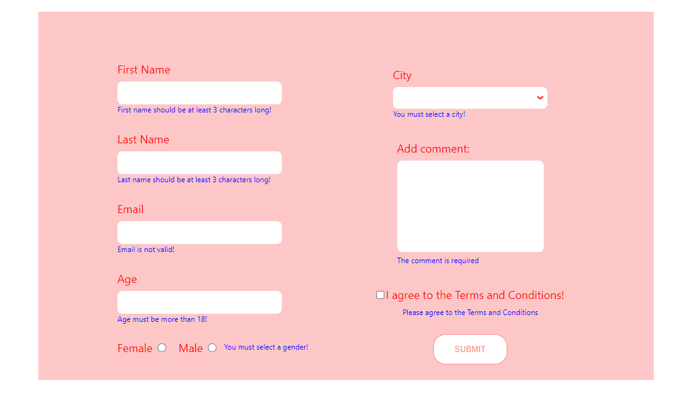

# Form

 

Standard form with different input fields

 
On submission, each field has validation

 
 

## Built with:
* ReactJS
* HTML & CSS

 
 

## For the back-end is used:
[SoftUni Practice Server](https://github.com/softuni-practice-server/softuni-practice-server)

To execute it manually open a command prompt and run `node server.js`.

 
 

## Available Scripts

In the project directory, you can run:

### `npm start`

Runs the app in the development mode.\
Open [http://localhost:3000](http://localhost:3000) to view it in your browser.

